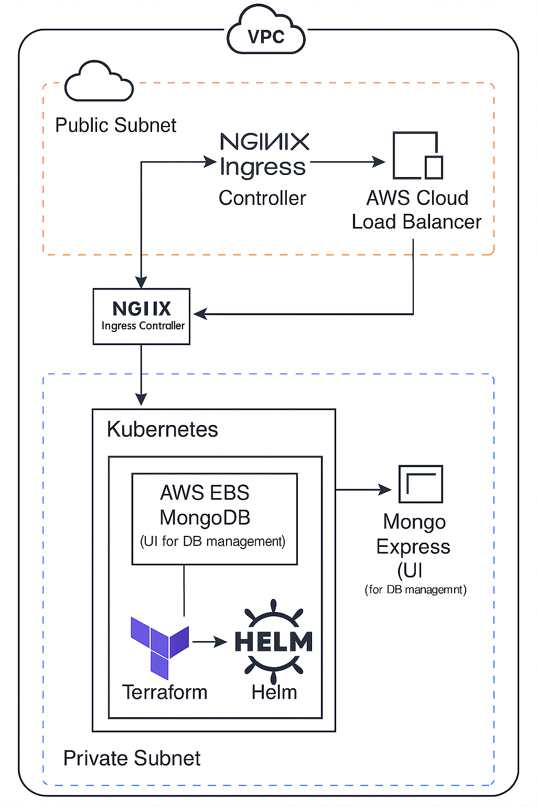

# MongoDB StatefulSet on AWS EKS with Terraform, Helm & Ingress

This project demonstrates how to deploy a self-hosted **stateful application** (MongoDB) on **Amazon EKS** using **Terraform**, **Helm**, and Kubernetes manifests. It also includes **Mongo Express** as a web-based MongoDB admin interface, exposed via **NGINX Ingress** and AWS **Cloud Load Balancer**.

The database is deployed as part of the cluster and serves as the backend data store for the application.

## Project Goals
- Learn how to deploy **StatefulSets** using Helm charts
- Understand persistent volume provisioning differences between cloud providers
- Implement Ingress-based routing with AWS Load Balancer integration
  
## Tech Stack
- **Terraform** 
- **Kubernetes (EKS)** 
- **Helm** 
- **AWS EBS CSI Driver** 
- **NGINX Ingress Controller** 
- **Mongo Express**
  
## Project Structure

```
├── kubernetes/
│ ├── mongodb-values.yaml
│ ├── mongodb-svc.yaml
│ ├── mongoexpress.yaml
│ ├── ingress.yaml
│ ├── configmap.yaml
│ └── secret.yaml
├── terraform/
│ ├── main.tf
│ ├── outputs.tf
│ ├── providers.tf
│ ├── variables.tf
│ ├── terraform.tfvars 
│ └── .gitignore
└── README.md
```

## How it works

1. **Infrastructure provisioning** – Terraform provisions the VPC and EKS cluster.
2. **Persistent storage setup** – The AWS EBS CSI Driver is installed to enable dynamic provisioning of EBS volumes for Kubernetes workloads.
3. **Database deployment** – MongoDB is deployed on the cluster using Helm as a StatefulSet. The values.yaml file overrides the default configuration, defining the number of replicas, persistent volumes, and other settings.
4. **UI for database management** – Mongo Express is deployed as a Kubernetes Deployment, providing a simple web-based interface to interact with MongoDB.
5. **Ingress and exposure** – The UI is exposed via the NGINX Ingress Controller, which is also deployed using Helm.

## Prerequisite:
- Terraform [installed](https://developer.hashicorp.com/terraform/tutorials/aws-get-started/install-cli)
- Kubectl [installed](https://v1-32.docs.kubernetes.io/docs/tasks/tools/)
- AWS CLI [installed](https://docs.aws.amazon.com/cli/latest/userguide/getting-started-install.html)
- Helm [installed](https://helm.sh/docs/intro/install/)

## Set Up
1. **Connect you environment to AWS**:

if its a local environment, [AWS CLI](https://docs.aws.amazon.com/cli/latest/userguide/getting-started-quickstart.html) can be used for connection or if its a remote server, simply attach an instance role that has the neccesary permission needed.

1. **Provision EKS Cluster**:
```
   terraform init
   terraform apply --auto-approve
```
   
2. **Install AWS EBS CSI Driver**:
```
kubectl apply -k "github.com/kubernetes-sigs/aws-ebs-csi-driver/deploy/kubernetes/overlays/stable/ecr/?ref=release-1.22"
kubectl get pods -n kube-system -l app=ebs-csi-controller
```
This command pulls the stable release manifest and applies all necessary resources (controller, daemonset, RBAC, etc.) and verify installation.

3. **Attach policy to the Node IAM role**:
```
aws iam attach-role-policy \
  --role-name <NodeInstanceRoleName> \
  --policy-arn arn:aws:iam::aws:policy/service-role/AmazonEBSCSIDriverPolicy
```
4. **Install MongoDB via Helm**:

Before installing mongodb, set the mongodb-values.yaml for the required replicaset and persistent volume.
```
helm install my-mongodb oci://registry-1.docker.io/bitnamicharts/mongodb \
  -f mongodb-values.yaml
```
5. **Create a service for Mongodb deployment**:

A headless service (with clusterIP: None) is useful for internal communication between MongoDB pods, for example when they need to discover each other in a replica set. However, this is not suitable for external applications like Mongo Express, which need a stable endpoint to connect to MongoDB.

To make MongoDB accessible to other applications inside the cluster, we need a ClusterIP service. This service provides a single stable DNS name and load balances connections across the MongoDB pods.
```
kubectl apply -f mongodb-svc.yaml
```
Check all the pods and services to comfirm they are running;
```
kubectl get pod
kubectl get svc
kubectl get all
```

6. **Deploy Secret and Configmap Volume**:

This is needed for the Mongoexpress to connect with the mongodb
```
kubectl apply -f secret.yaml
kubectl apply -f configmap.yaml
```
6. **Deploy Mongo Express**:
```
kubectl apply -f mongoexpress.yaml
```
7. **Install Nginx ingress controller via helm**:

```
helm install ingress-nginx oci://ghcr.io/nginxinc/charts/ingress-nginx \
  --namespace ingress-nginx \
  --create-namespace
```
8. **Deploy Ingress rule**:

`kubectl apply -f ingress.yaml`

9. **Accessing via mongoexpress UI**:

`kubectl get all`

The IP address on the ingress service would be accessible on the browser, you can store info on the database
Mongo Express credentials (default): admin / pass.

**Bonus:** you can try to scale down the replicaset after saving in the database, confirm there is no pod running, then scale up the replicaset and you will find your database would be attached back to it,
thats the power of persistent volume in the cloud, pod or node restarting doesnt mean storage is lost.

**Limitations of Self-Hosted**

While self-hosting gives control and flexibility, it also introduces challenges such as:
- Backup and restore processes.
- Security patching and updates.
- Monitoring and scaling for production workloads.
- High availability and failover management.

##  Key Lessons Learned
- **Linode vs AWS Storage Provisioning** – Linode’s Kubernetes engine comes with a default storage provisioner, but AWS EKS requires installing and configuring the **EBS CSI Driver** with proper IAM permissions.
- **StatefulSet Basics** – Understanding PVC binding, PV lifecycle, and how pods reconnect to the same volumes after restarts.
- **Ingress Integration** – AWS LB + NGINX Ingress can seamlessly route traffic to internal services and external services

## Improvements

- mongodb-values.yaml, terraform lock files and statefiles, .tfvars should all be in the .gitignore file
- EBS CSI drive can be installed, IAM policy attached, mongodb deployed via helm all usinf terraform, this helps maintain versions
- Secret.yaml can be done using third party tool like aws secret manager and referencing it in the secret.yaml instead of exposing it
- Lastly, our application can be accessed via domain name, it can be configured in the ingress rule.
- TLS for a secured connection using certmanager


## Next Steps 

To take this setup closer to production readiness, the following can be implemented:
- Automated Backups – configure scheduled snapshots or use tools like Velero.
- Monitoring & Alerting – integrate with Prometheus + Grafana for insights.
- Maintenance – apply updates and patches regularly.
- Scaling – configure replica sets for fault tolerance.

- Migration to Managed Services – consider AWS DocumentDB for reduced operational overhead.

